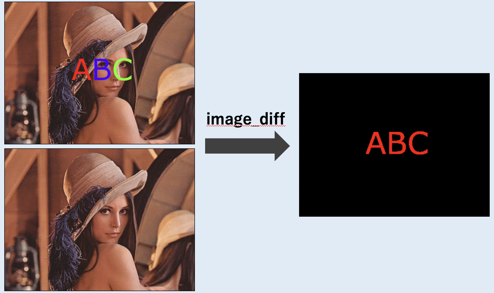
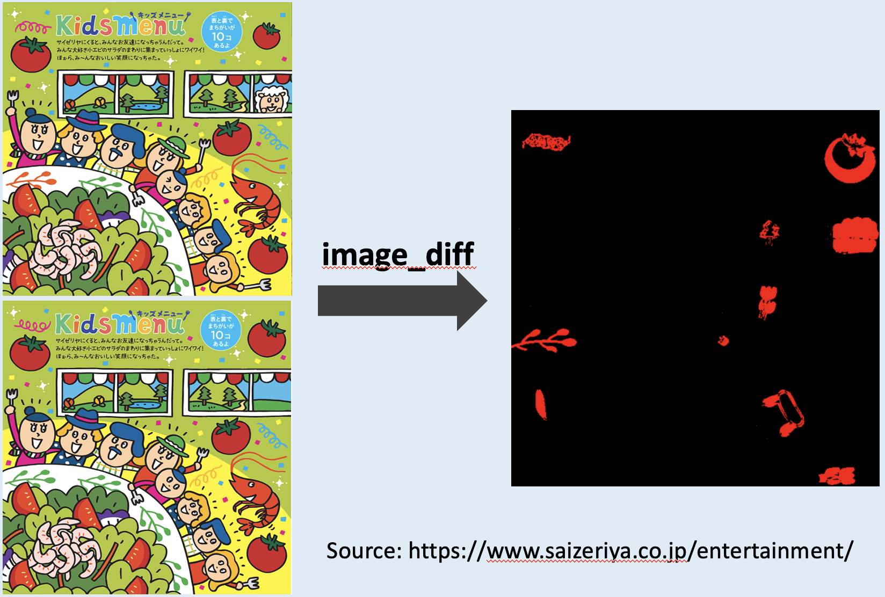

# image-diff
This is software for visually displaying the difference between two images.



# The Purpose of This Software
This software has been developed to solve `"spot the difference"` easily.  


# Requirement
* Python 3.6 or later
* opencv-python 4.6.0 or later
* numpy 1.19 or later

# Installation
```console
pip install opencv-python
pip install numpy
```

# Usage
```console
usage: image_diff.py [-h] [-rx RANGE_X] [-ry RANGE_Y] [-th THRESH] [-j JOBS]
                     FILE1 FILE2

positional arguments:
  FILE1                 A first image file name to compare.
  FILE2                 A second image file name to compare.

optional arguments:
  -h, --help            show this help message and exit
  -rx RANGE_X, --range-x RANGE_X
                        Range of X coordinates to move the image.
  -ry RANGE_Y, --range-y RANGE_Y
                        Range of Y coordinates to move the image.
  -th THRESH, --thresh THRESH
                        Threshold to be considered different pixel if greater
                        than.
  -j JOBS, --jobs JOBS  Number of jobs to process.
```

Let's try sample.  
```console
python image_diff.py ./sample/rena1.jpg ./sample/rena2.jpg 
image-diff version 1.00
(https://github.com/kazumasa-kusaba/image-diff)

[=================================================>] 100.0%
(A windows will appear on your screen...)
```

**If it does not work well, try the following things.**  
* Use `"-rx"`, `"-ry"` options
  * These are values that determine the range to move the image.
  * If the value is set, this software try to move an image and find the place where color differences are minimal.
  * Unit is pixel.
  * A few pixels is recommended.
* Use `"-th"` option
  * You can change the value between 0 ~ 255.
  * If the value is set low, more differences will appear.

